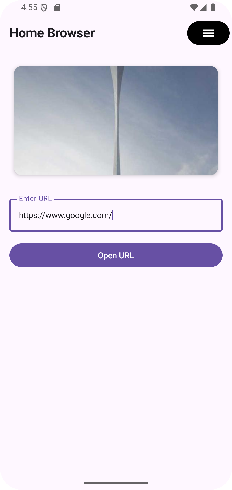
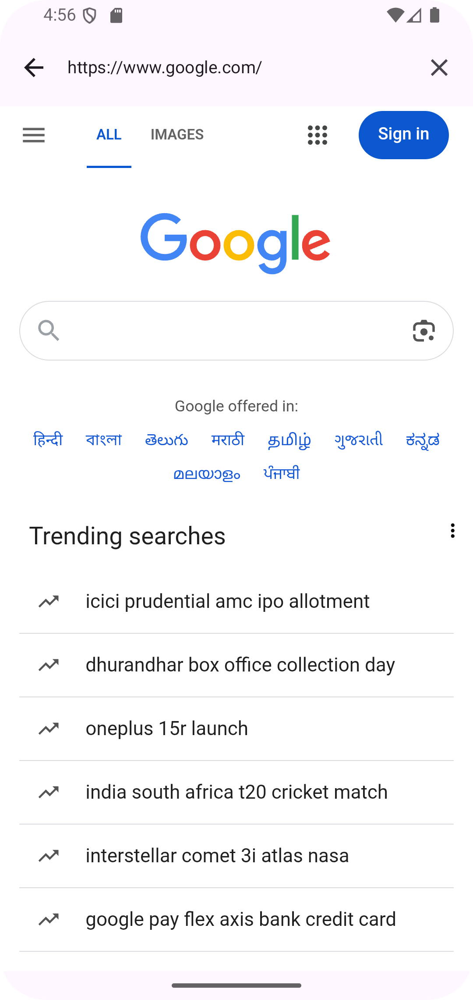
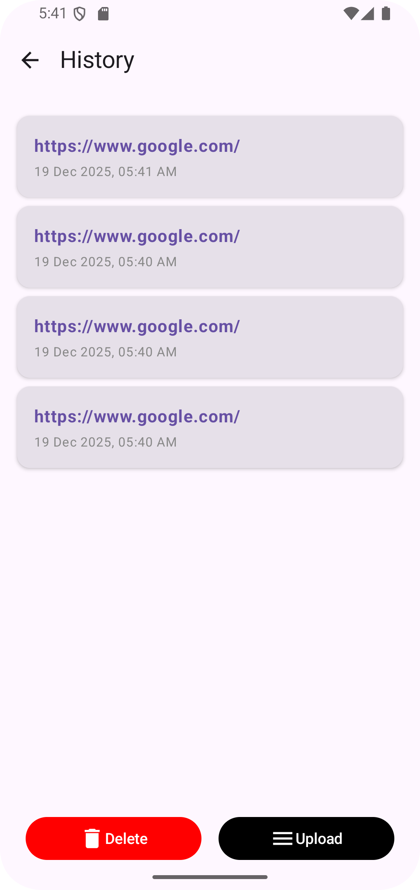

# Android WebView App

## Overview
This is a simple Android app where users can enter a website link and open it inside the app using a WebView. The app also saves visited links and shows them in a history screen.

---

## Screenshots

| Home Screen | WebView Screen | History Screen |
|------------|---------------|----------------|
|  |  |  |

---

## Features
- Enter a URL and open it in a WebView
- Basic URL validation
- Image carousel on the home screen
- View visited URLs with date and time
- Clear saved history
- Upload saved history to a dummy API

---

## Tech Stack
- Kotlin
- Jetpack Compose
- MVVM
- Hilt
- Navigation Compose
- Room Database
- Retrofit
- Android WebView

